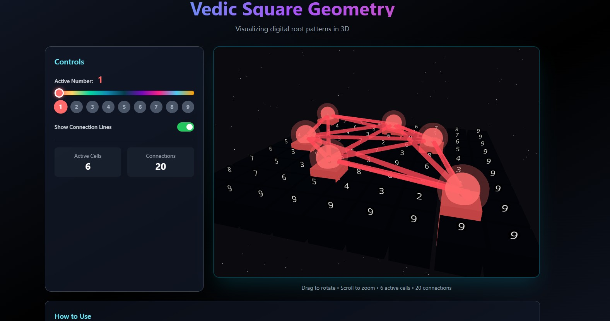

# 🧮 Vedic Square Simulation

An interactive **Vedic Square visualization** built with **React**,  and **React Three Fiber**.

This project simulates the mathematical structure known as the **Vedic Square**, where each cell contains the **digital root of the multiplication of its row and column indices**.
The result creates fascinating **symmetrical numeric patterns**, which are visualized here using an interactive **3D environment**.

---

# 📖 What is a Vedic Square?

A **Vedic Square** is a grid where:

```
cell(i, j) = digital_root(i × j)
```

Example:

| × | 1 | 2 | 3 | 4 | 5 |
| - | - | - | - | - | - |
| 1 | 1 | 2 | 3 | 4 | 5 |
| 2 | 2 | 4 | 6 | 8 | 1 |
| 3 | 3 | 6 | 9 | 3 | 6 |
| 4 | 4 | 8 | 3 | 7 | 2 |
| 5 | 5 | 1 | 6 | 2 | 7 |

The square reveals **repeating mathematical cycles and geometric symmetry**.

---

# ✨ Features

* 🔢 Vedic square generation
* 🎨 Interactive 3D visualization
* 📊 Real-time grid rendering
* ⚡ Built with modern React architecture
* 🧠 Mathematical pattern exploration
* 📱 Responsive interface

---

# 🛠️ Tech Stack

* **React**
* **React Three Fiber**
* **Three.js**
* **Vite**
* **CSS / Tailwind (optional)**

---

# 📂 Project Structure

```
vedic-square-simulation/
│
├── public/
│
├── src/
│   ├── components/
│   │   ├── VedicGrid.tsx
│   │   ├── SquareCell.tsx
│   │   └── Scene.tsx
│   │
│   ├── utils/
│   │   ├── digitalRoot.ts
│   │   └── generateVedicSquare.ts
│   │
│   ├── App.tsx
│   └── main.tsx
│
├── package.json
├── tsconfig.json
└── README.md
```

---

# 🚀 Installation

Clone the repository:

```bash
git clone https://github.com/your-username/vedic-square-simulation.git
```

Enter the project directory:

```bash
cd vedic-square-simulation
```

Install dependencies:

```bash
npm install
```

Run the development server:

```bash
npm start
```

Open in browser:

```
http://localhost:5173
```

---

# 🧮 Digital Root Function

The digital root is calculated by repeatedly summing the digits of a number until one digit remains.

Example:

```
38 → 3 + 8 = 11
11 → 1 + 1 = 2
```

Digital Root = **2**

Mathematically:

```
digital_root(n) = 1 + ((n - 1) mod 9)
```

---

# 🎮 How to Use

1. Launch the application
2. Generate the Vedic square grid
3. Explore the patterns visually
4. Interact with the 3D simulation

---

# 📸 Demo

You can add screenshots or animations here.

Example:

```md

```

---

# 📚 Educational Value

This project helps explore:

* Mathematical patterns
* Modular arithmetic
* Digital root properties
* Interactive mathematical visualization
* 3D graphics with React

---

# 🔮 Future Improvements

* Animated number cycles
* Pattern highlighting
* Dynamic grid sizes
* Educational explanations
* Export visualization as image

---

# 🤝 Contributing

Contributions are welcome.

1. Fork the repository
2. Create a feature branch

```
git checkout -b feature/my-feature
```

3. Commit changes

```
git commit -m "Add feature"
```

4. Push

```
git push origin feature/my-feature
```

5. Open a Pull Request

---

# 📄 License

This project is licensed under the **MIT License**.

---

# 👨‍💻 Author

Developed by **Badr Moujahid**

If you like this project, consider giving it a ⭐ on GitHub.
